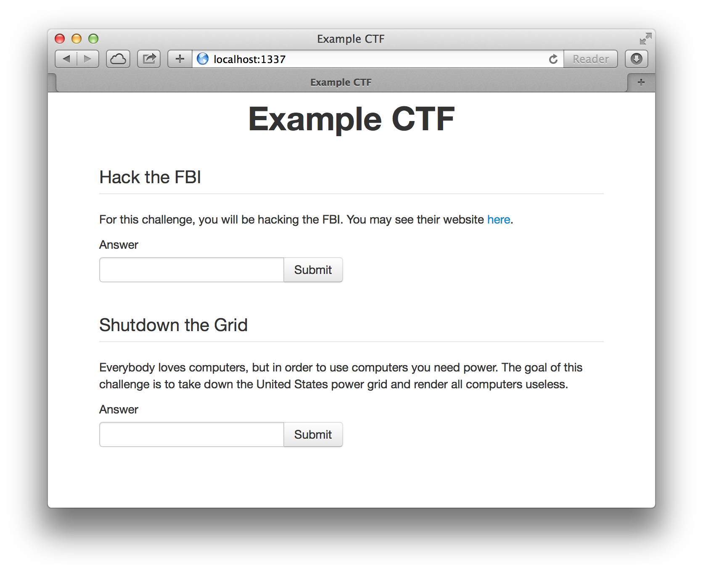

# CTF Engine

This project provides a user-friendly way to manage a CTF contest. The web app allows you to configure any number of challenges and receive submissions.

# Usage

Once you are in the project root, run the following command:

    coffee src/server.coffee /path/to/config.json /path/to/subs.json port

This will start the CTF engine running on a given port with the specified configuration. Note that the server will automatically create the config.json and subs.json file for you if the path you specified does not yet exist. Moreover, as you change settings on the server, they will automatically be updated in your configuration JSON file.

### General Settings

For the following examples, I will be assuming that you are running the server on `http://localhost:1337`.

You may access the control panel by going to `http://localhost:1337/control`. You may be asked to login. The default password is `admin`, but you may change it as you please from the control panel.

There are currently two basic settings for a CTF contest. These are the *identification type* and the *contest title*. When you change either of these fields, you should either hit enter or click the "Save" button below the two fields to save your changes.

The identification type is the prompt which the user sees when they submit a correct answer and are asked to identify themselves to receive a potential prize. This could be "Email", "Youtube Username", etc.

The second basic setting is the contest name. This appears in the titles on each page and as a heading on the homepage.

### Challenge List

You may add and remove challenges as you see fit.

The challenge name and body are shown to the user on the homepage. The name is plaintext, but the body is HTML data which will be written directly to the page. Thus, you may include links, styles, etc. in the challenge body.

The answer SHA1 is the SHA1 hash of the "flag"&ndash;the answer to the question. Each challenge must have exactly one answer. The CTF engine does not supply a tool to compute this SHA1 hash; you must do it yourself.

### Seeing submissions

Assuming your challenges aren't impossible, you will eventually receive some submissions. You can see these submissions in your the submissions.json file. The data will be formated as an array of objects of the form:

    {
      "name": "Name",
      "ident": "Identifier",
      "challenge": "Name of the Challenge",
      "answer": "The Answer They Submitted"
    }

This file will automatically be re-written to for each new submission.

# Screenshots

## Homepage

## Control Panel

